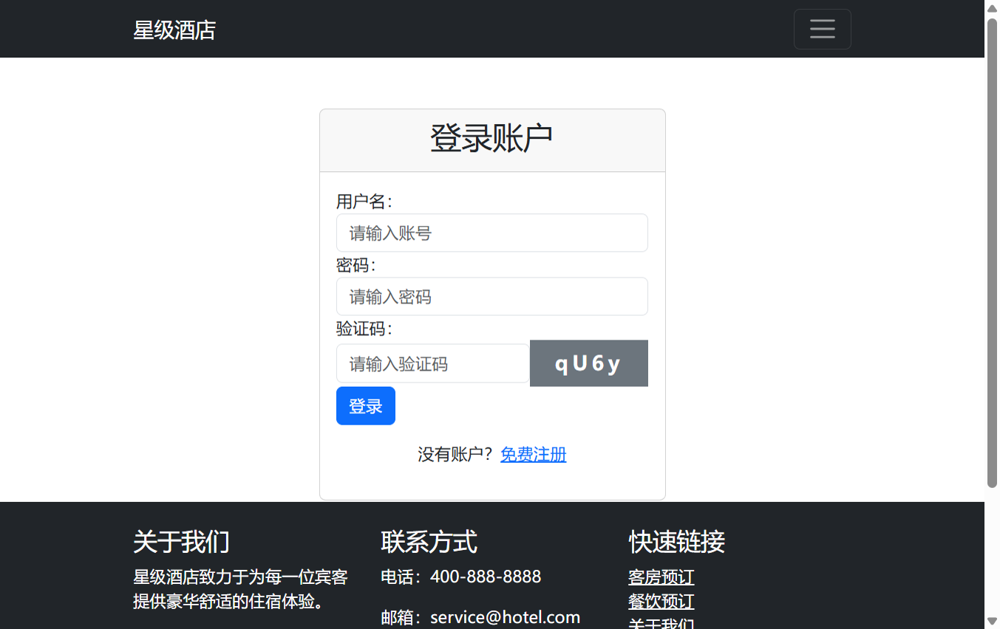
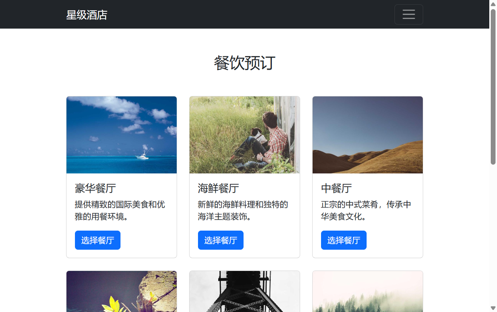
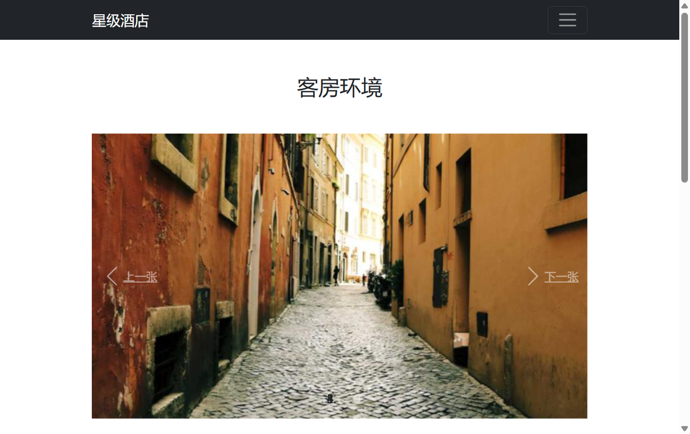
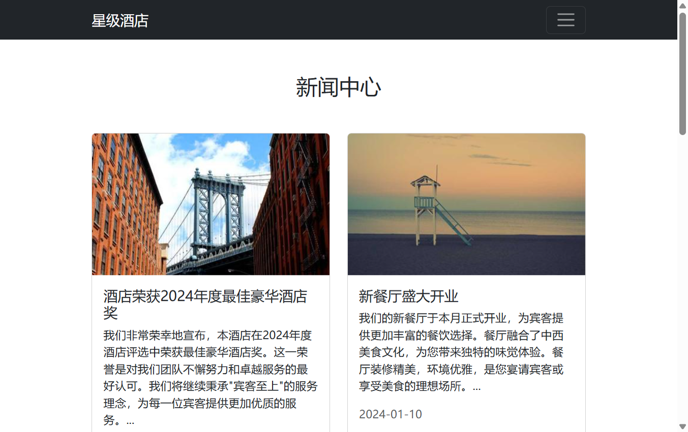
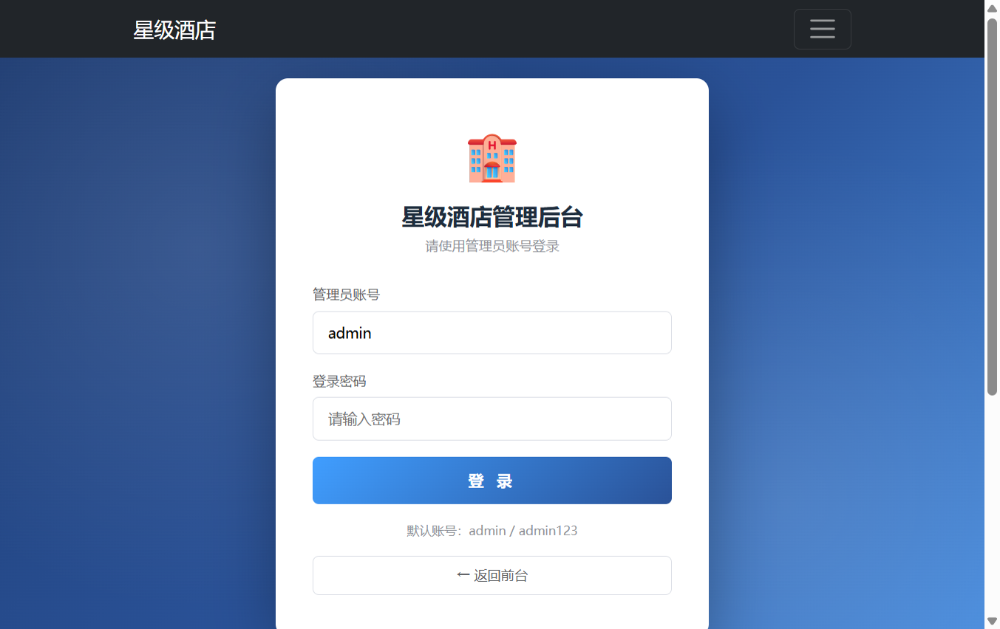
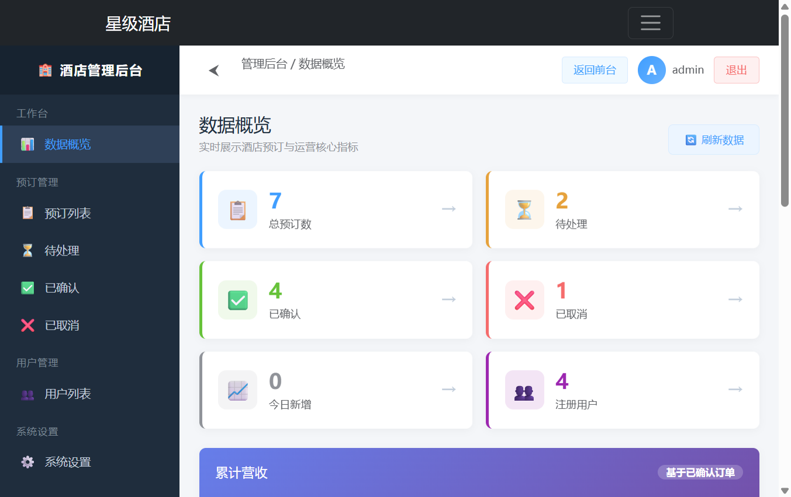
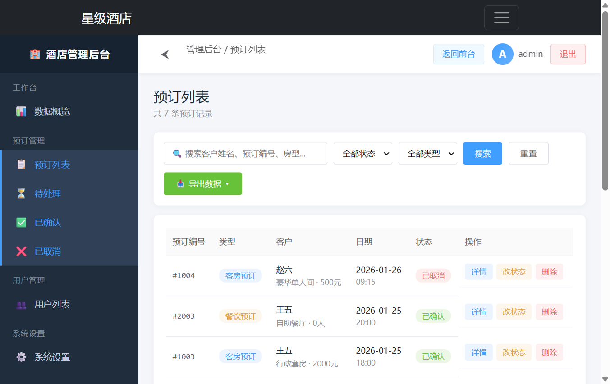
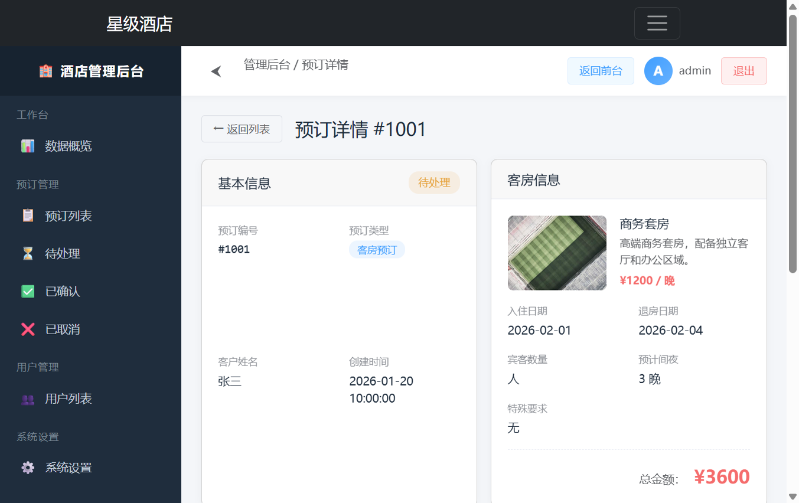
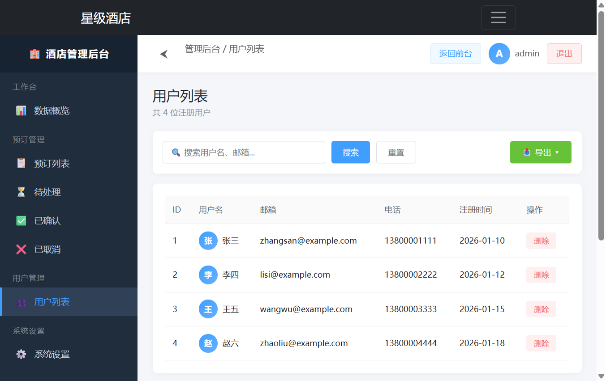
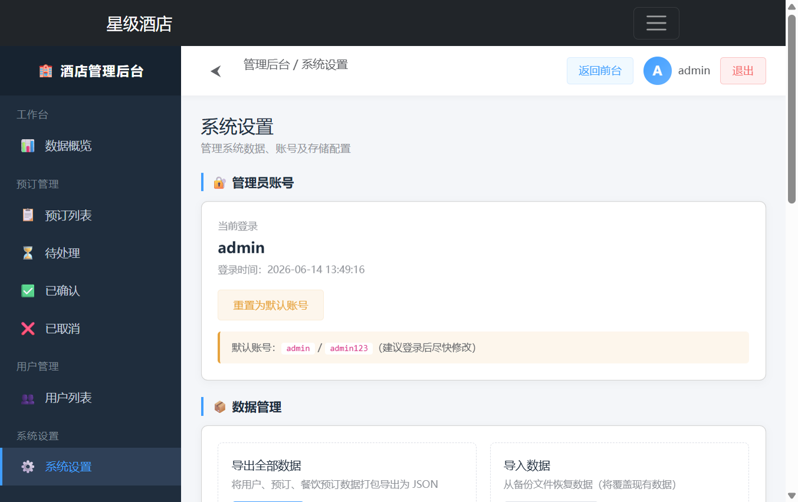

# 计算机工程学院
# 期末作品报告

| 项目 | 内容 |
|------|------|
| **课程名称** | 前端框架技术 |
| **学院** | 计算机工程学院 |
| **专业** | 计算机科学与技术 |
| **年级** | 2025级09班（专升本） |
| **学号** | 202539190619 |
| **姓名** | 罗新宇 |
| **作品名称** | 星级酒店预订网站 |
| **任课教师** | 邹兴华 |

---

## 项目标题

**星级酒店预订网站（服务类电商商城）**

## 内容简介

本项目是一个基于 Vue 3 + Vite + Vue Router 构建的单页面酒店预订系统，涵盖用户认证、客房预订、餐饮预订、服务预订、新闻资讯、关于我们、联系方式等模块。项目采用组合式 API（`<script setup>`）与选项式 API 混合开发，使用了自定义指令（`v-focus`、`v-validate`）、动态组件切换、计算属性、侦听器、生命周期钩子等 Vue 3 核心特性。界面基于 Bootstrap 5 构建，响应式布局适配多端设备。

## 项目特色

1. **技术栈完整**：Vue 3 组合式 API + 选项式 API + Vue Router + Vite。
2. **自定义指令**：实现 `v-focus` 自动聚焦与 `v-validate` 表单校验指令。
3. **动态组件切换**：使用 `<component :is>` 实现客房/餐饮/服务三大分类的动态渲染。
4. **搜索联动**：导航栏搜索框通过 URL query 参数联动首页 `computed` 与 `watch` 实现实时筛选。
5. **双 API 风格**：既有 `<script setup>` 组合式组件，也包含选项式 API 组件（如 RoomList）。
6. **完整业务闭环**：注册 → 登录 → 浏览 → 搜索 → 预订 → 订单确认。
7. **模拟后端**：通过 `api.js` 模拟接口，`localStorage` 持久化用户与订单数据。
8. **实时时钟与轮播**：定时器 + 生命周期钩子实现实时日期显示与自动轮播。

## 开发计划（时间及内容安排）

| 阶段 | 时间 | 内容安排 |
|------|------|----------|
| 需求分析 | 第 1 周 | 确定选题、梳理功能需求、设计原型 |
| 环境搭建 | 第 2 周 | 初始化 Vite + Vue 3 项目，配置路由、Bootstrap |
| 基础组件 | 第 3 周 | 完成 NavBar、Footer、Carousel 公共组件 |
| 用户模块 | 第 4 周 | 开发 Login、Register 组件，含自定义指令与验证码 |
| 业务模块 | 第 5 周 | 开发 Home、RoomBooking、DiningBooking、RoomEnvironment |
| 信息模块 | 第 6 周 | 开发 News、About、Contact 页面 |
| 功能整合 | 第 7 周 | 实现搜索、动态组件切换、预订流程 |
| 测试优化 | 第 8 周 | 图片容错、表单校验、交互优化 |
| 文档撰写 | 第 9 周 | 撰写期末作品报告、整理核心代码 |

---

## 首页（index.html）

1. **文件名**：`index.html`
2. **作用**：Vite 项目入口 HTML 模板，挂载 `#app`，加载 Vue 应用。
3. **主要技术**：
   1. Vite 构建入口配置（`<script type="module" src="/src/main.js">`）；
   2. 通过 CDN 方式引入 Bootstrap 5 样式与脚本；
   3. 基础 HTML5 语义化结构与 meta 配置；
   4. 页面字体、图标、favicon 配置。
4. **功能实现截图**：

## 根组件（App.vue）

1. **文件名**：`src/App.vue`
2. **作用**：项目根组件，挂载 NavBar、router-view、Footer，作为整个应用的布局骨架。
3. **主要技术**：
   1. Vue 3 单文件组件（SFC）结构；
   2. `<script setup>` 组合式 API 导入子组件；
   3. `<router-view />` 路由出口实现 SPA 页面切换；
   4. 全局样式重置（`margin:0; padding:0; box-sizing:border-box`）。
4. **功能实现截图**：

## 登录注册组件（Login.vue）

1. **文件名**：`src/pages/Login.vue`
2. **作用**：实现用户登录、表单校验、验证码生成与验证，登录成功后跳转首页。
3. **主要技术**：
   1. `v-model` 双向绑定用户名、密码、验证码；
   2. `v-if` 控制错误提示与成功提示显示；
   3. 自定义指令 `v-focus` 自动聚焦、`v-validate` 失焦校验；
   4. `@submit.prevent` 提交表单、`async/await` 调用登录接口；
   5. `localStorage` 持久化登录状态。
4. **功能实现截图**：

## 组件名称 1：导航栏组件（NavBar.vue）

1. **文件名**：`src/components/NavBar.vue`
2. **作用**：提供全站导航菜单、搜索框、登录状态显示、退出登录入口。
3. **主要技术**：
   1. `useRouter` / `useRoute` 路由编程式跳转与激活态判断；
   2. `v-for` 渲染导航项数组；
   3. 搜索框通过 `router.push({ query })` 传递关键词；
   4. 响应式折叠菜单（移动端汉堡菜单）。
4. **功能实现截图**：

## 组件名称 2：首页（Home.vue）

1. **文件名**：`src/pages/Home.vue`
2. **作用**：展示轮播图、实时时钟、推荐客房（支持搜索筛选）、酒店特色服务。
3. **主要技术**：
   1. `computed` 计算属性实现模糊搜索筛选；
   2. `watch` 侦听路由 query 变化并更新 `searchQuery`；
   3. `onMounted` / `onUnmounted` 管理定时器；
   4. `@error` 图片加载失败回退占位图；
   5. Bootstrap Grid 布局（`row` / `col-md-4`）。
4. **功能实现截图**：

## 组件名称 3：轮播组件（Carousel.vue）

1. **文件名**：`src/components/Carousel.vue`
2. **作用**：首页顶部图片自动轮播，支持手动切换与指示器点击。
3. **主要技术**：
   1. `ref` 管理 `currentIndex` 响应式索引；
   2. `setInterval` + 生命周期钩子实现自动轮播；
   3. Bootstrap Carousel CSS 类；
   4. `v-for` 渲染图片列表与指示器。
4. **功能实现截图**：

## 组件名称 4：客房预订页（RoomBooking.vue）

1. **文件名**：`src/pages/RoomBooking.vue`
2. **作用**：整合客房、餐饮、服务三大预订入口，支持动态组件切换与订单提交。
3. **主要技术**：
   1. **动态组件** `<component :is="currentComponent">` 实现分类切换；
   2. `computed` 根据 `currentCategory` 返回对应组件；
   3. 日期选择器（`v-model` + `min` 最小值限制）；
   4. `@select` 事件子传父通信；
   5. 表单校验（日期范围、必选客房、宾客数）。
4. **功能实现截图**：

## 组件名称 5：客房列表组件（RoomList.vue，选项式 API 示例）

1. **文件名**：`src/components/RoomList.vue`
2. **作用**：展示可选客房列表，提供选择/取消选择交互。
3. **主要技术**：
   1. `defineProps` 接收父组件传入数据；
   2. `defineEmits` 向父组件派发 `select` 事件；
   3. `:class` 动态绑定选中态样式；
   4. `v-for` 渲染卡片列表。
4. **功能实现截图**：

## 组件名称 6：餐饮预订页（DiningBooking.vue）

1. **文件名**：`src/pages/DiningBooking.vue`
2. **作用**：独立的餐饮预订页面，提供餐厅选择、用餐日期/时段/人数选择。
3. **主要技术**：
   1. `v-model` 多字段双向绑定；
   2. 校验规则（日期、时段、人数必选）；
   3. `alert-success/alert-danger` 反馈；
   4. `async` 模拟异步请求。
4. **功能实现截图**：

## 组件名称 7：客房环境页（RoomEnvironment.vue）

1. **文件名**：`src/pages/RoomEnvironment.vue`
2. **作用**：展示酒店客房环境图、设施列表与服务承诺。
3. **主要技术**：
   1. `v-for` 渲染设施列表；
   2. 图片网格布局（Grid/Flex）；
   3. `scoped` 样式隔离；
   4. Bootstrap 卡片与 badge 标签。
4. **功能实现截图**：

## 组件名称 8：新闻页（News.vue）

1. **文件名**：`src/pages/News.vue`
2. **作用**：展示酒店新闻资讯列表与详情。
3. **主要技术**：
   1. `ref` 管理新闻列表数据；
   2. `v-if/v-show` 控制列表/详情视图切换；
   3. 详情页路由或弹窗两种模式；
   4. 响应式卡片网格。
5. **功能实现截图**：

---

## 十、管理员后台系统

### 10.1 功能概述

为酒店管理方开发了一套完整的管理员后台界面系统，提供客户预订信息的实时接收、展示、处理与存储功能。管理员可通过后台进行数据统计、预订审核、用户管理与系统配置。

### 10.2 技术实现

| 模块 | 核心技术 | 功能说明 |
|------|----------|----------|
| 管理员登录 | JWT Token + localStorage 鉴权 | 账号密码验证，登录态持久化，路由守卫拦截未授权访问 |
| 数据概览 | computed + mock API | 统计总预订数、待处理、已确认、已取消、累计营收、注册用户数 |
| 预订列表 | 响应式布局 + 搜索筛选 | 分页展示，支持按客户姓名、预订编号、房型模糊搜索，按状态/类型筛选 |
| 预订详情 | 动态路由 + 状态更新 | 查看预订完整信息，支持待处理→已确认/已取消状态流转 |
| 数据导出 | Blob + CSV/JSON | 一键导出当前筛选结果为 CSV（Excel）或 JSON 文件 |
| 用户管理 | CRUD 操作 | 查看注册用户列表、搜索、删除违规用户 |
| 系统设置 | JSON 序列化/反序列化 | 数据备份导出、数据恢复导入、示例数据清空 |
| 布局框架 | 侧边栏 + 顶部导航 | 可折叠侧边栏、面包屑、后台/前台切换 |

### 10.3 关键代码片段

**路由守卫（权限校验）**：
```javascript
router.beforeEach((to, from, next) => {
  if (to.meta.requiresAdmin && !isAdminLoggedIn()) {
    next({ path: '/admin/login', query: { redirect: to.fullPath } })
  } else {
    next()
  }
})
```

**Mock API - 预订列表查询**：
```javascript
export const getBookingList = async (filters = {}) => {
  await delay(300)
  let list = allBookings()
  const { keyword, status, type, page = 1, pageSize = 10 } = filters
  if (keyword) { /* 模糊匹配客户、编号、房型 */ }
  if (status) list = list.filter(b => b.status === status)
  if (type) list = list.filter(b => b.type === type)
  const total = list.length
  const data = list.slice((page - 1) * pageSize, page * pageSize)
  return { success: true, data: { list: data, total, page, pageSize } }
}
```

### 10.4 功能实现截图

1. **管理员登录页**：
   

2. **数据概览（Dashboard）**：
   

3. **预订列表（搜索/筛选/导出）**：
   

4. **预订详情与状态更新**：
   

5. **用户管理**：
   

6. **系统设置**：
   


**难点 1：图片加载不稳定**
- 问题：使用外部 AI 图片生成服务时出现加载慢、失败、显示占位等情况。
- 解决：统一替换为 `picsum.photos` 稳定图片服务，每张图片绑定 `@error` 事件，失败时回退到指定占位图。

**难点 2：搜索框与首页联动不生效**
- 问题：导航栏搜索提交后，首页未实时响应关键词变化。
- 解决：通过 `router.push({ query: { search } })` 传参，在 Home.vue 使用 `watch(() => route.query.search)` 监听变化，配合 `computed` 实现模糊筛选。

**难点 3：动态组件切换时状态残留**
- 问题：从客房切换到餐饮分类时，之前选中的客房状态仍然保留。
- 解决：新增 `resetSelection()` 方法，在分类切换事件中清空所有选中状态，保证数据一致性。

**难点 4：表单校验逻辑分散**
- 问题：多处表单重复编写校验代码，维护成本高。
- 解决：封装 `validation.js` 工具函数（`validateUsername`、`validatePassword`、`validateDateRange`），并自定义 `v-validate` 指令，通过配置对象支持 `required`、`min`、`max`、`pattern` 等规则，失焦自动触发。

**难点 5：SPA 刷新后登录态丢失**
- 问题：Vuex/Pinia 未引入时，组件内部状态刷新即丢失。
- 解决：使用 `localStorage` 持久化 `user` 对象，NavBar 在 `onMounted` 时读取恢复登录状态，退出时清除。

---

## 收获与思考

通过本次项目开发，我对 Vue 3 框架的核心机制有了系统性的认识：

1. **组合式 API 与选项式 API 的对比**：`<script setup>` 让逻辑组织更灵活，按功能拆分显著提升可读性；而选项式 API 结构清晰，适合传统开发习惯。两者在同一项目中的混用加深了我对 Vue 双向编程范式的理解。

2. **自定义指令的价值**：`v-focus` 与 `v-validate` 的实现过程让我掌握了指令生命周期钩子（`mounted`、`updated`）的用法，理解了如何封装通用 DOM 操作逻辑以提高代码复用率。

3. **响应式数据的本质**：通过 `ref`、`computed`、`watch` 的使用，我认识到 Vue 3 的响应式是基于 Proxy 的惰性追踪，`computed` 具有缓存特性而 `watch` 适合副作用处理。

4. **动态组件的场景**：`<component :is>` 让多分类切换变得优雅，相比 `v-if/v-else` 嵌套更易扩展，也为后续学习 Vue 的内置 `<keep-alive>` 缓存机制打下了基础。

5. **工程化思维**：Vite 的快速构建、按需路由懒加载、组件样式隔离、ES Module 模块化等实践，让我体验到现代前端工程的高效与规范。

---

## 附录：主要源代码（展示关键代码即可）

### App.vue

```vue
<script setup>
import NavBar from './components/NavBar.vue'
import Footer from './components/Footer.vue'
</script>

<template>
  <div class="min-vh-100 flex flex-col">
    <NavBar />
    <main class="flex-grow">
      <router-view />
    </main>
    <Footer />
  </div>
</template>

<style>
* {
  margin: 0;
  padding: 0;
  box-sizing: border-box;
}
body {
  font-family: 'Microsoft YaHei', sans-serif;
}
</style>
```

### main.js（自定义指令 + 应用入口）

```javascript
import { createApp } from 'vue'
import App from './App.vue'
import router from './router'

const app = createApp(App)
app.use(router)

app.directive('focus', {
  mounted(el) {
    el.focus()
  },
  updated(el, binding) {
    if (binding.value) {
      el.focus()
    }
  }
})

app.directive('validate', {
  mounted(el, binding) {
    el.addEventListener('blur', () => {
      const value = el.value
      const rules = binding.value
      let isValid = true
      let errorMessage = ''

      if (rules.required && !value) {
        isValid = false
        errorMessage = rules.message || '此字段不能为空'
      } else if (rules.min && value.length < rules.min) {
        isValid = false
        errorMessage = rules.message || `至少需要${rules.min}个字符`
      } else if (rules.max && value.length > rules.max) {
        isValid = false
        errorMessage = rules.message || `最多${rules.max}个字符`
      } else if (rules.pattern && value && !rules.pattern.test(value)) {
        isValid = false
        errorMessage = rules.message || '格式不正确'
      }

      el.classList.toggle('is-invalid', !isValid)
      const parent = el.parentElement
      const feedback = parent.querySelector('.invalid-feedback')
      if (feedback) {
        feedback.textContent = errorMessage
      }
    })
  }
})

app.mount('#app')
```

### Login.vue（关键片段）

```vue
<script setup>
import { ref } from 'vue'
import { useRouter } from 'vue-router'
import { login } from '../utils/api.js'
import { validateUsername, validatePassword } from '../utils/validation.js'

const router = useRouter()
const username = ref('')
const password = ref('')
const captcha = ref('')
const generatedCaptcha = ref('')
const errors = ref({})
const loading = ref(false)

const generateCaptcha = () => {
  const chars = 'ABCDEFGHJKLMNPQRSTUVWXYZabcdefghjkmnpqrstuvwxyz23456789'
  let result = ''
  for (let i = 0; i < 4; i++) {
    result += chars.charAt(Math.floor(Math.random() * chars.length))
  }
  generatedCaptcha.value = result
}
generateCaptcha()

const handleLogin = async () => {
  errors.value = {}
  const usernameResult = validateUsername(username.value)
  if (!usernameResult.valid) errors.value.username = usernameResult.message

  const passwordResult = validatePassword(password.value)
  if (!passwordResult.valid) errors.value.password = passwordResult.message

  if (captcha.value.toLowerCase() !== generatedCaptcha.value.toLowerCase()) {
    errors.value.captcha = '验证码错误'
    generateCaptcha()
  }

  if (Object.keys(errors.value).length > 0) return

  loading.value = true
  const result = await login(username.value, password.value)
  loading.value = false

  if (result.success) {
    localStorage.setItem('user', JSON.stringify(result.data))
    setTimeout(() => router.push('/'), 1000)
  }
}
</script>
```

### RoomBooking.vue（动态组件切换关键片段）

```vue
<script setup>
import { ref, computed } from 'vue'
import RoomList from '../components/RoomList.vue'
import DiningList from '../components/DiningList.vue'
import ServiceList from '../components/ServiceList.vue'

const currentCategory = ref('rooms')

const componentMap = {
  rooms: RoomList,
  dining: DiningList,
  services: ServiceList
}

const currentComponent = computed(() => componentMap[currentCategory.value])

const categories = [
  { id: 'rooms', name: '客房预订', icon: '🏨' },
  { id: 'dining', name: '餐饮预订', icon: '🍽️' },
  { id: 'services', name: '服务预订', icon: '💆' }
]

const resetSelection = () => {
  selectedRoom.value = null
  selectedRestaurant.value = null
}
</script>

<template>
  <div class="mb-4">
    <div class="nav nav-tabs">
      <button
        v-for="category in categories"
        :key="category.id"
        class="nav-link"
        :class="{ active: currentCategory === category.id }"
        @click="currentCategory = category.id; resetSelection()"
      >
        {{ category.icon }} {{ category.name }}
      </button>
    </div>
  </div>

  <component :is="currentComponent" ... />
</template>
```

### router/index.js

```javascript
import { createRouter, createWebHistory } from 'vue-router'

const routes = [
  { path: '/', name: 'Home', component: () => import('../pages/Home.vue') },
  { path: '/login', name: 'Login', component: () => import('../pages/Login.vue') },
  { path: '/register', name: 'Register', component: () => import('../pages/Register.vue') },
  { path: '/room-booking', name: 'RoomBooking', component: () => import('../pages/RoomBooking.vue') },
  { path: '/dining-booking', name: 'DiningBooking', component: () => import('../pages/DiningBooking.vue') },
  { path: '/room-environment', name: 'RoomEnvironment', component: () => import('../pages/RoomEnvironment.vue') },
  { path: '/news', name: 'News', component: () => import('../pages/News.vue') },
  { path: '/about', name: 'About', component: () => import('../pages/About.vue') },
  { path: '/contact', name: 'Contact', component: () => import('../pages/Contact.vue') }
]

const router = createRouter({
  history: createWebHistory(),
  routes
})

export default router
```

### validation.js

```javascript
export const validateUsername = (value) => {
  if (!value) return { valid: false, message: '用户名不能为空' }
  if (value.length < 3) return { valid: false, message: '用户名至少 3 位' }
  if (!/^[a-zA-Z0-9_]+$/.test(value)) return { valid: false, message: '仅支持字母数字下划线' }
  return { valid: true }
}

export const validatePassword = (value) => {
  if (!value) return { valid: false, message: '密码不能为空' }
  if (value.length < 6) return { valid: false, message: '密码至少 6 位' }
  return { valid: true }
}

export const validateDateRange = (checkIn, checkOut) => {
  if (!checkIn || !checkOut) return { valid: false, message: '请选择日期' }
  if (new Date(checkOut) <= new Date(checkIn)) {
    return { valid: false, message: '退房日期需晚于入住日期' }
  }
  return { valid: true }
}
```

---

**项目完成日期**：2026 年 6 月  
**开发者**：罗新宇  
**学号**：202539190619  
**班级**：2025 级 09 班（专升本）
